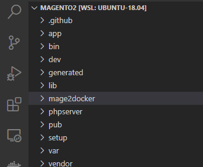

# Getting Started with an existing Magento application

We've designed Mage2Docker to be as simple as possible to use with an existing Magento 2 Open Source or Magento 2 Commerce project.

> This setup assumes that you have already setup your Magento account, composer, and your Magento composer credentials. If you have not done this, see the [new project setup](./new-project.md).

Setup is broken down into a few discrete steps, follow along and in a few minutes you will have a working local Magento 2 project.

1. [Setting up the Mage2Docker environment](#setting-up-the-mage2docker-environment)
2. [Installing the Magento 2 Dependencies](#installing-the-magento-2-dependencies)
3. [Finalizing Magento 2 Installation](#finalizing-magento-2-installation)
4. [Taking the Environment Down](#taking-the-environment-down)

## Setting up the Mage2Docker Project

:no_entry: **In the root of your Magento 2 project:**

```bash
git clone https://www.github.com/graycoreio/mage2docker \
    && echo -e "\nmage2docker/" >> .gitignore \
    && cd mage2docker
```

The end result should look like:



> From here on out, we assume that you're working within the new `mage2docker` directory nested inside your project, not the root Magento folder.

### Configuring Docker Compose
Mage2Docker comes with a basic environment configuration file `.env.sample`, you can utilize this file to tailor your environment to your needs. 

#### Copy this file into a new `.env` file.**

```bash
cp .env.sample .env
```

You will need to uncomment the following configurations and select the [appropriate configurations](./configuring.md) for your environment. We've configured some basic defaults for out-of-the-box behavior.

```bash
COMPOSE_PROJECT_NAME
COMPOSE_FILE
```

For further configuration [see the configuration guide](./configuring.md).

> If you have multiple Magento projects on your system, **please ensure that the COMPOSE_PROJECT_NAME value is unique**, otherwise you will find out that you've accidentally shared data between different projects and you'll be in for a world of pain.

### Configuring Your Hosts File
Add the following entry to your **host** system's `/etc/hosts` file.

> On WSL2 this is the Native Windows host file (`/c/Windows/System32/drivers/etc/hosts`)

```bash
127.0.0.1 magento2.test
```

### Elasticsearch
On Linux enviroments (including WSL), you will need to [increase the Virtual Memory available to Elasticsearch](https://www.elastic.co/guide/en/elasticsearch/reference/current/vm-max-map-count.html). You can do so by:

```bash
sysctl -w vm.max_map_count=262144
```

> This setting will not persist upon reboot. To persist this setting, see the above link.

## Starting the Mage2Docker Environment
With all the configuration behind us, you can simply:

```bash
docker-compose up -d
```

> Note that the `-d` detaches from the container logstream so that you can continue to use the same terminal. You can remove it if you'd like to see the logs for all the containers.

## Installing the Magento 2 Dependencies
You can run `composer` commands directly on the container to install the Magento 2 dependencies.

```bash
docker-compose exec magento2 composer install
```

## Finalizing Magento 2 Installation
We can now finalize the Magento 2 installation and configure Magento 2 to use the utilities provided by the Mage2Docker environment.

```bash
docker-compose exec magento2 bin/magento setup:install --base-url=https://magento2.test \
--db-host=database --db-name=magento2 --db-user=magento2 --db-password=magento2 \
--admin-firstname=Magento --admin-lastname=User --admin-email=user@example.com \
--admin-user=admin --admin-password=admin123 --language=en_US \
--currency=USD --timezone=America/Chicago \
--cleanup-database

docker-compose exec magento2 bin/magento setup:config:set --cache-backend=redis --cache-backend-redis-server=cache --cache-backend-redis-db=0
docker-compose exec magento2 bin/magento setup:config:set --page-cache=redis --page-cache-redis-server=fullpagecache --page-cache-redis-db=0
docker-compose exec magento2 bin/magento setup:config:set --session-save=redis --session-save-redis-host=sessioncache --session-save-redis-db=0
docker-compose exec magento2 bin/magento setup:config:set --amqp-host="message_queue" --amqp-port="5672" --amqp-user="guest" --amqp-password="guest"
```

## Taking the Environment Down
Taking the environment down is fairly simple as well.

> Note: The data for your database is PERSISTENT, so you can tear down the containers and your database will still remain. The next time you `docker-compose up` you will be right where you left off.

```bash
docker-compose down
```
